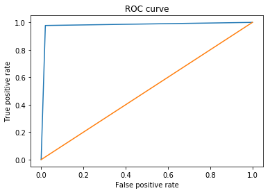

# Twitter Sentiment Analysis

Lets see if we can determine if certain tweets are negative or positive

## Import Libaries

### Import Pandas and Matlab Libraries


```python
import pandas as pd
from matplotlib import pyplot as plt
%matplotlib inline
```

### Import SciKit-Learn Libraries


```python
from sklearn.model_selection import train_test_split
from sklearn.feature_extraction.text import CountVectorizer
from sklearn.naive_bayes import GaussianNB
from sklearn.metrics import f1_score
from sklearn.metrics import roc_curve
```

## Download Dataset from University of Michigan

The dataset can be found from this [kaggle page](https://www.kaggle.com/c/si650winter11)


```python
data_df = pd.read_csv("trainingdata.txt", sep='\t')
```

Lets shuffle the data, just incase it is ordered


```python
data_df = data_df.sample(frac=1).reset_index(drop=True)
```

Split the data into training and test sets


```python
X_train, X_test, y_train, y_test = train_test_split(data_df['tweet'], data_df['label'])
```

Implement Bag of Words 


```python
count_vect = CountVectorizer()
X_train_counts = count_vect.fit_transform(X_train)
X_test_counts = count_vect.transform(X_test)
```

Create Naive Bayesian Model using Scikit-Learn


```python
#Naive Bayes 
gnb = GaussianNB()
y_pred = gnb.fit(X_train_counts.toarray(), y_train).predict(X_test_counts.toarray())
```

How Accurate and Precise is our model?


```python
fscore = f1_score(y_test, y_pred)
print(fscore)
```

    0.9643779039752194
    


```python
rocscores = roc_curve(y_test, y_pred)
plt.plot(rocscores[0], rocscores[1])
plt.plot(rocscores[0],rocscores[0])
plt.xlabel('False positive rate')
plt.ylabel('True positive rate')
plt.title('ROC curve')
plt.show()
```




